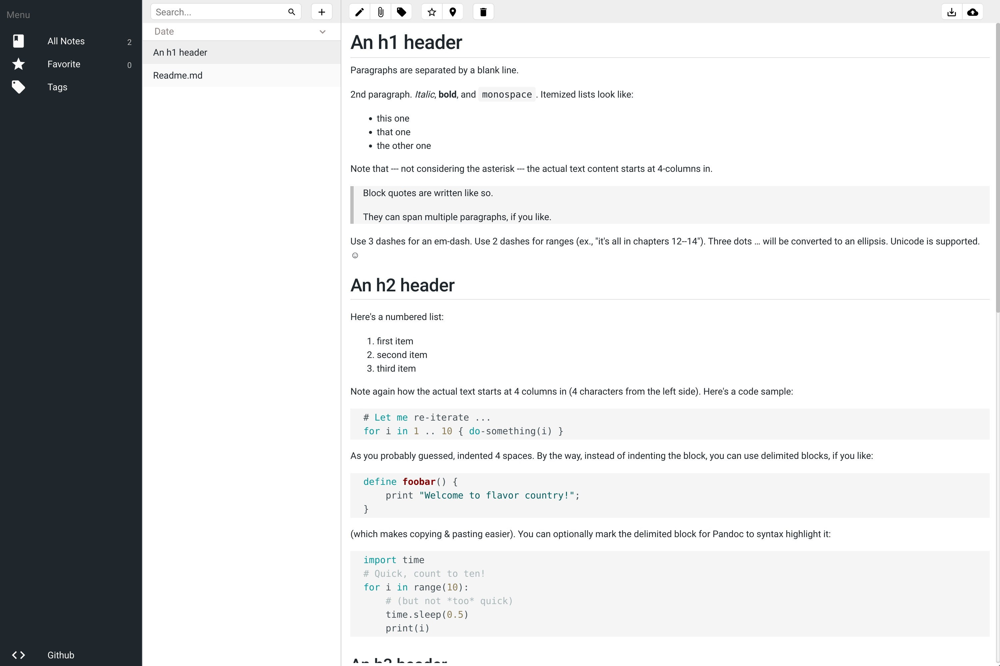

# [Nwotable](https://nwotable.herokuapp.com) 

Nwotable is a [Vue.js](https://github.com/vuejs/vue) PWA inspired by the crazy work of [Fabio Spampinato](https://github.com/fabiospampinato) and his [app](https://github.com/notable/notable).

The app is still in development so some features may not work. Mobile devices aren't currently supported.

## :stars: Show Your Support
Please give a :star: if this project helped you!

## Contributing
If you want to contribute to Nwotable to add a feature or improve the code contact me: [alexnegrel13@gmail.com](mailto:alexnegrel13@gmail.com) or make a pull request.

### Customize the configuration
See [Configuring quasar.conf.js](https://quasar.dev/quasar-cli/quasar-conf-js).

### :scroll: License
MIT © Alexandre Negrel
